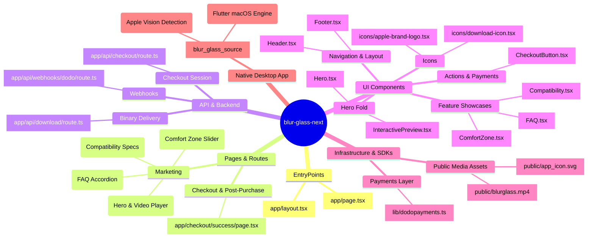

# Codebase Architecture Map

## High-Level State & Context Cache

- **Current Technical Debt:** Automated headless browser testing encountered driver CDN connectivity issues; local testing works via Next.js dev server on port 3000.
- **Active Feature Branch Context:** Embedded hero video player with macOS window frame, sound toggle, interactive scrubber, and direct checkout CTA.
- **Critical Absolute Paths:**
  - Landing Page: `/Users/utkarsh/Documents/blur-glass-next/app/page.tsx`
  - Video Preview: `/Users/utkarsh/Documents/blur-glass-next/components/InteractivePreview.tsx`
  - Checkout Button: `/Users/utkarsh/Documents/blur-glass-next/components/CheckoutButton.tsx`
  - Checkout API: `/Users/utkarsh/Documents/blur-glass-next/app/api/checkout/route.ts`
  - Dodo Payments Client: `/Users/utkarsh/Documents/blur-glass-next/lib/dodopayments.ts`
  - Styling: `/Users/utkarsh/Documents/blur-glass-next/app/globals.css`
